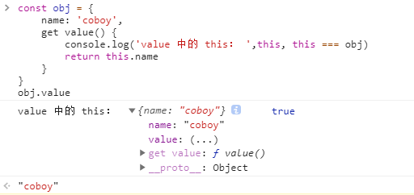
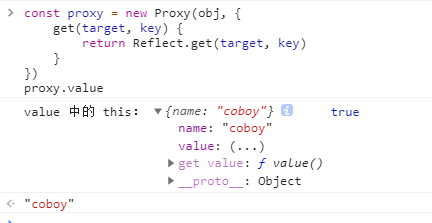
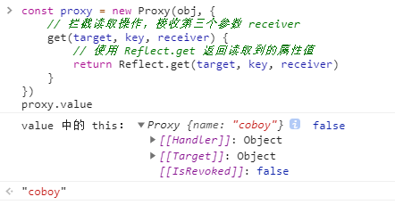
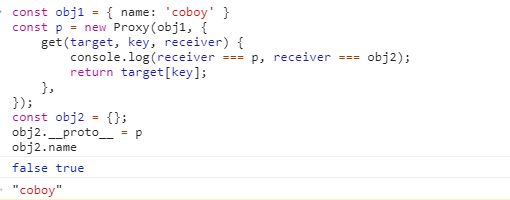
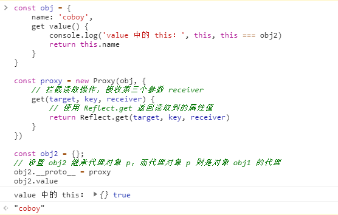

# 关于 Vue3 源码当中的 Proxy 和 Reflect 的那些事儿

### 前言

什么是 Proxy 呢？ 简单来说，使用 Proxy 可以创建一个代理对象，它允许我们拦截并重新定义对一个对象的基本操作。

Proxy 只能够拦截对一个对象的基本操作，不能拦截对一个对象的复合操作。

任何在 Proxy 的拦截器中能够找到的方法，都能够在 Reflect 中找到同名函数。

Reflect.get 函数还能接收第三个参数，即指定接收者 receiver，你可以把它理解为函数调用过程中的 this。

单纯 Reflect 很容易被原始的方法代替，目前也并不一定要使用 Reflect，但 Reflect + Proxy 则可以产生 1 + 1 > 2 的效果。

修改某些 Object 方法的返回结果，让其变得更规范化。如 Object.defineProperty(obj, name, desc) 在无法定义属性时，会抛出一个错误，而 Reflect.defineProperty(obj, name, desc) 则会返回 false 。

### Reflect 的基本操作

对象读取操作

普通读取方式

```javascript
const obj = { name: 'coboy', age: 25 }
console.log(obj.name) // 'coboy'
```

使用 Reflect.get 的读取方式

```javascript
console.log(Reflect.get(obj, 'name')) // coboy
```

对象设置操作

普通方式设置

```javascript
obj.sex = 'boy'
console.log(obj.sex) // 'boy'
```

使用 Reflect.set 的设置方式

```javascript
Reflect.set(obj, 'address', '广东')
console.log(obj.address) // '广东'
```

这么一看，Reflect 好像没什么特别，甚至有点画蛇添足，不急，这只是冰山一角。

### Reflect 修改某些 Object 方法的返回结果，让其变得更合理

有一些场景我们需要监测对象的属性的设置是否成功，我们在 Vue2 的源码中看到有这么一段代码：

```javascript
export let supportsPassive = false
if (inBrowser) {
  try {
    const opts = {}
    Object.defineProperty(opts, 'passive', ({
      get () {
        /* istanbul ignore next */
        supportsPassive = true
      }
    }: Object)) // https://github.com/facebook/flow/issues/285
    window.addEventListener('test-passive', null, opts)
  } catch (e) {}
}
```

这段代码是什么意思，我们可以不用管，我们只需要注意到它使用了 `try catch` 来监听代码是否运行正常，这里主要监测的是 Object.defineProperty 的设置是否成功。那么为什么要监测 Object.defineProperty 是否设置成功呢？

是因为 `Object.defineProperty(obj, name, desc)` 在无法定义属性时，会抛出一个错误，并且会阻塞后面的代码运行。

```javascript
Object.defineProperty(obj, 'like', {
    get() {
        return 'coboy'
    }
})

Object.defineProperty(obj, 'like', {
    get() {
        return 'cobyte'
    }
})
console.log('被阻塞了')
```

上面这段代码就会报错，并且后面的打印也不输出了，被阻塞了。

```javascript
VM103:8 Uncaught TypeError: Cannot redefine property: like
    at Function.defineProperty (<anonymous>)
    at <anonymous>:8:8
```

那么想要不被阻塞呢就要通过 `try catch` 来捕获异常。

```javascript
try {
    Object.defineProperty(obj, 'like', {
        get() {
            return 'coboy'
        }
    })
} catch (error) {
    console.log(error)
}

try {
    Object.defineProperty(obj, 'like', {
        get() {
            return 'cobyte'
        }
    })
} catch (error) {
    console.log(error)
}
```

很明显这样写太不雅观了，如果使用 Reflect 则不存在这个问题了。

```javascript
Reflect.defineProperty(obj, 'like', {
    get() {
        return '中国'
    }
})

Reflect.defineProperty(obj, 'like', {
    get() {
        return '中国'
    }
})

console.log('没有阻塞')
```

那么 Reflect 的这些到底有什么用呢？接下来我们看看 Reflect 跟 Proxy 结合的威力。

### Reflect 跟 Proxy 结合的威力

我们先来看看下面的例子：

```javascript
const obj = {}
Object.defineProperty(obj,"name",{
    value:"coboy",
    writable: false //当设置为 false 的时候当前对象的属性值不允许被修改
})

obj.name = 'cobyte'
console.log(obj.name) // 'coboy'
```

我们创建了一个对象，并且通过 Object.defineProperty 设置了它的**属性描述符** value 值为： coboy，并且该属性值设置不允许修改，然后我们尝试修改它的 name 属性值，发现并没有成功，最终还是打印了最初的定义的 `coboy`。

我们将上面的代码和 Proxy 结合一下：

```javascript
const proxy = new Proxy(obj, {
    get(target, key,) {
        // 注意，这里我们没有使用 Reflect 来进行读取
        return target[key]
    },
    set(target, key, value) {
        // 注意，这里同样没有使用 Reflect 来进行设置
        return target[key] = value
    }
})
proxy.name = '王五'
console.log('阻塞了')
```

我们通过 Proxy 代理了上面设置的对象 obj，然后通过代理对象去修改 name 的属性值发现报错了，并且后面的代码也不执行，被阻塞了。

```
VM258:10 Uncaught TypeError: 'set' on proxy: trap returned truish for property 'name' which exists in the proxy target as a non-configurable and non-writable data property with a different value
```

接下来我们使用 Reflect 对 Proxy 代理设置的代码进行改造一下：

```javascript
const proxy = new Proxy(obj, {
    get(target, key,) {
        return Reflect.get(target, key)
    },
    set(target, key, value) {
        return Reflect.set(target, key, value)
    }
})
proxy.name = '王五'
console.log('正常运行')
```

使用了 Reflect 进行设置之后，居然不报错了，代码正常运行了。是因为 Reflect.get()、Reflect.set() 具有返回值，并且 Proxy 的 handler 的 get、set 也要求有返回值，所以这时使用 Reflect 再合适不过了。

我们再看看上面的例子：

```javascript
const obj = {}
Object.defineProperty(obj,"name",{
    value:"coboy",
    writable: false //当设置为 false 的时候当前对象的属性值不允许被修改
})

console.log(Reflect.set(obj, 'name', 'cobyte')) // false
console.log('不阻塞了') // '不阻塞了'
```

我们发现通过 Object.defineProperty 设置了不可修改的属性之后，我们使用 Reflect.set() 去修改的时候，它是有返回值的，并且返回值是 false。


### Proxy 只能够拦截对一个对象的基本操作，不能拦截对一个对象的复合操作

```javascript
const obj = {
    name: 'coboy',
    fn() {
        console.log(this.name, this === p)
    }
}

const p = new Proxy(obj, {
    get(target, key, receiver) {
        return Reflect.get(target, key)
    }
})

p.fn() // 打印 'coboy', true
```

Proxy 只能够拦截对一个对象的基本操作，不能拦截对一个对象的复合操作。调用对象下的方法就是典型的非基本操作，如上面的：p.fn() 实际上调用一个对象下的方法，是由两个基本语义组成的。第一个基本语义是 get，即先通过 get 操作得到 p.fn 属性。第二个基本语义是函数调用，即通过 get 得到 p.fn 的值后再调用它。p 是代理对象，而函数中的 this 是谁调用它，它就指向谁，所以此时 fn 中的 this 就指向了代理对象 p。


### 访问器属性中的 this 的指向问题

接下来再看下面的例子：

```javascript
const obj = {
    name: 'coboy',
    get value() {
        console.log('value 中的 this：', this, this === obj)
        return this.name
    }
}
obj.value
```

打印出的结果是：

 

我们可以看到，对象 obj 的 value 属性是一个访问器属性，它返回了 this.name 属性值。我们在打印台中可以看到，this.name 的值就是 'coboy'，同时也可以得知 value 属性的访问器里面的 this 就是指向对象 obj 本身，所以 this.name 的返回值，其实就是 obj.name，自然 this.name 的返回值就是 ‘coboy’ 了。

接下来我们使用 Proxy 对对象 obj 进行代理：

```javascript
const proxy = new Proxy(obj, {
    get(target, key) {
        return Reflect.get(target, key)
    }   
})
proxy.value
```

打印出的结果是：

 

我们通过代理对象 proxy 去访问 value 属性，最终还是返回了 'coboy'，但我们看到 obj 的 value 属性访问器中的 this 仍然指向对象 obj。这是正确的吗？我们设想一下，将来当 effect 注册的副作用函数执行时，读取 proxy.value 属性，发现 proxy.value 是一个访问器属性，因此执行 getter 函数。由于在 getter 函数中通过 this.name 读取了 name 的属性值，那么副作用函数将要和属性 name 之间建立联系。但要建立联系，必须是响应式数据的读取才能发生，而上面的 this 是指向了 obj，obj对象是一个原始数据，并不是响应式对象，所以将无法和副作用函数建立联系。

### Proxy 和 Reflect 中的 receiver 参数

这个时候，就要说一下 Reflect.get() 的第三个参数了，先给出解决问题的代码：

```javascript
const proxy = new Proxy(obj, {
    // 拦截读取操作，接收第三个参数 receiver
    get(target, key, receiver) {
        // 使用 Reflect.get 返回读取到的属性值
        return Reflect.get(target, key, receiver)
    }   
})
proxy.value
```

我们再来看此时打印的结果：

 

这个时候，我们发现 obj 里的 value 访问器里的 this 就已经指向了代理对象 proxy 了。很显然这时通过响应式对象读取 name 属性，便会在副作用函数与响应式数据之间建立响应式联系，从而达到依赖收集的效果。

那么这其实的奥秘到底在哪呢？接下我们再了解一下代理对象的 get 拦截函数接收第三个参数 receiver 是个啥东西。

```javascript
const proxy = new Proxy(obj, {
    // 拦截读取操作，接收第三个参数 receiver
    get(target, key, receiver) {
        console.log('receiver:', receiver, receiver === proxy)
        // 使用 Reflect.get 返回读取到的属性值
        return Reflect.get(target, key, receiver)
    }   
})
proxy.value
```

我们来看看打印结果：

 

代理对象的 get 拦截函数接收第三个参数 receiver 就是 响应式对象 proxy，所以 Reflect.get(target, key, receiver) 就像 Reflect.get(target, key).call(receiver) [ 模拟，伪代码 ]，改变 this 的指向。

如上面的代码所示，代理对象的 get 拦截函数接收第三个参数 receiver，它代表谁在读取属性，例如：

```javascript
proxy.value // 代理对象 proxy 在读取 value 属性
```
###  Proxy 实例对象的 get 陷阱上的 receiver 参数到底指向谁？

请看下面的例子：

```javascript
const obj1 = { name: 'coboy' }
const p = new Proxy(obj1, {
    get(target, key, receiver) {
        console.log(receiver === p, receiver === obj2);
        return target[key];
    },
});
const obj2 = {};
// 设置 obj2 继承代理对象 p，而代理对象 p 则是对象 obj1 的代理
obj2.__proto__ = p
obj2.name 
```

打印的结果：

 

我们可以看到 proxy 对象的 get 陷阱上打印 `receiver === p` 是为 false 的，即 Proxy 实例对象的 get 陷阱上的 receiver 参数不一定是指向代理对象实例本身，而 打印 `receiver === obj2` 则为 true，所以我们可以得知，通过   obj2.name 的访问触发了属性访问器，是 obj2 对象触发的，**所以谁触发了 get 陷阱，receiver 就指向谁**。

所以为了印证这个说法，我们再看一个例子：

```javascript
const obj = {
    name: 'coboy',
    get value() {
        console.log('value 中的 this：', this, this === obj2)
        return this.name
    }
}

const proxy = new Proxy(obj, {
    // 拦截读取操作，接收第三个参数 receiver
    get(target, key, receiver) {
        // 使用 Reflect.get 返回读取到的属性值
        return Reflect.get(target, key, receiver)
    }   
})

const obj2 = {};
// 设置 obj2 继承代理对象 p，而代理对象 p 则是对象 obj1 的代理
obj2.__proto__ = proxy
obj2.value 
```

打印结果：

 

由于是 obj2 触发了 value 的属性访问器，从而触发了 Proxy 中的 get 陷阱，所以此时 get 陷阱的 receiver 参数就是 obj2, 然后通过 Reflect.get() 的第三个参数改变 this 的指向，所以 obj 对象中的 value 属性访问器中的 this 就指向了 get 陷阱的 receiver 参数，也就是 obj2，而最终的打印结果也证明了这一点，所以更加证明了**谁触发了 get 陷阱，receiver 就指向谁** 。


### 总结

在本文章中，我们了解了 Proxy 与 Reflect 的一些使用方法。Vue3 的响应式数据是基于 Proxy 实现的，Proxy 可以为其他对象创建一个代理对象，它允许我们拦截并重新定义对一个对象的基本操作。在实现代理的过程中，我们遇到了访问器属性的 this 指向问题，这需要使用 Reflect 来和 Proxy 一起使用并指定正确的 receiver 来解决。


最后推荐一个学习vue3源码的库，它是基于崔效瑞老师的开源库mini-vue而来，在mini-vue的基础上实现更多的vue3核心功能，用于深入学习 vue3， 让你更轻松地理解 vue3 的核心逻辑。 

Github地址：[mini-vue3-plus](https://link.juejin.cn/?target=https%3A%2F%2Fgithub.com%2Famebyte%2Fmini-vue3-plus) 

