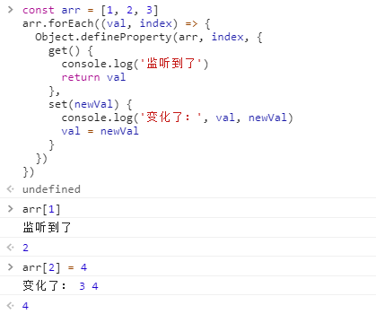
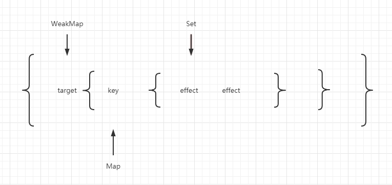

# 面试官的步步紧逼：Vue2 和 Vue3 的响应式比对
### 前言

技术栈是 Vue 的同学，在面试中难免会被问到 Vue2 和 Vue3 的相关知识点的实现原理和比较，面试官是步步紧逼，一环扣一环。

Vue2 的响应式原理是怎么样的？

Vue3 的响应式原理又是怎么样的？

Vue2 中是怎么监测数组的变化的？

Vue3 中又是怎么监测数组的变化的？

在问完你 Vue2 的数组的响应式原理之后，接着可能会补上一句，为什么要通过重写数组原型的 7 个方法来对数组进行监测？是因为 defineProperty 真的不能监测数组变化吗？Vue3 真的只使用 Proxy 就可以实现对数组的代理了吗？还需要进行什么设置呢？

Vue2 和 Vue3 的响应式实现原理具体是非常复杂和细节非常繁琐的，但我们需要在面试中去说清楚其中的原理，这就需要我们进行宏观和高度的概括总结。本文主要从面试的角度去讲解相关的实现原理，相关代码只是一个辅助理解。

### 问题1：Vue2 的响应式原理是怎么样的？

所谓响应式就是首先建立响应式数据和依赖之间的关系，当这些响应式数据发生变化的时候，可以通知那些绑定这些数据的依赖进行相关操作，可以是 DOM 更新，也可以是执行一个回调函数。

我们知道 Vue2 的对象数据是通过 Object.defineProperty 对每个属性进行监听，当对属性进行读取的时候，就会触发 getter，对属性进行设置的时候，就会触发 setter。

```javascript
/**
* 这里的函数 defineReactive 用来对 Object.defineProperty 进行封装。
**/
function defineReactive(data, key, val) {
   // 依赖存储的地方
   const dep = new Dep()
   Object.defineProperty(data, key, {
       enumerable: true,
       configurable: true,
       get: function () {
           // 在 getter 中收集依赖
           dep.depend()
           return val
       },
       set: function(newVal) {
           val = newVal
           // 在 setter 中触发依赖
           dep.notify()
       }
   }) 
}
```

那么是什么地方进行属性读取呢？就是在 Watcher 里面，Watcher 也就是所谓的依赖。在 Watcher 里面读取数据的时候，会把自己设置到一个**全局的变量**中。

```javascript
/**
* 我们所讲的依赖其实就是 Watcher，我们要通知用到数据的地方，而使用这个数据的地方有很多，类型也不一样，有* 可能是组件的，有可能是用户写的 watch，我们就需要抽象出一个能集中处理这些情况的类。
**/
class Watcher {
    constructor(vm, exp, cb) {
        this.vm = vm
        this.getter = exp
        this.cb = cb
        this.value = this.get()
    }

    get() {
        Dep.target = this
        let value = this.getter.call(this.vm, this.vm)
        Dep.target = undefined
        return value
    }

    update() {
        const oldValue = this.value
        this.value = this.get()
        this.cb.call(this.vm, this.value, oldValue)
    }
}
```

在 Watcher 读取数据的时候也就触发了这个属性的监听 getter，在 getter 里面就需要进行依赖收集，这些依赖存储的地方就叫 Dep，在 Dep 里面就可以把**全局变量中的依赖**进行收集，收集完毕就会把**全局依赖变量**设置为空。将来数据发生变化的时候，就去 Dep 中把相关的 Watcher 拿出来执行一遍。

```javascript
/**
* 我们把依赖收集的代码封装成一个 Dep 类，它专门帮助我们管理依赖。
* 使用这个类，我们可以收集依赖、删除依赖或者向依赖发送通知等。
**/
class Dep {
    constructor() {
        this.subs = []
    }
    
    addSub(sub) {
        this.subs.push(sub)
    }
    
    removeSub(sub) {
        remove(this.subs, sub)
    }

    depend() {
        if(Dep.target){
            this.addSub(Dep.target)
        }
    }

    notify() {
        const subs = this.subs.slice()
        for(let i = 0, l = subs.length; i < l; i++) {
            subs[i].update()
        }
    }
}

// 删除依赖
function remove(arr, item) {
    if(arr.length) {
        const index = arr.indexOf(item)
        if(index > -1){
            return arr.splice(index, 1)
        } 
    }
}
```


总的来说就是通过 Object.defineProperty 监听对象的每一个属性，当读取数据时会触发 getter，修改数据时会触发 setter。

然后我们在 getter 中进行依赖收集，当 setter 被触发的时候，就去把在 getter 中收集到的依赖拿出来进行相关操作，通常是执行一个回调函数。

我们收集依赖需要进行存储，对此 Vue2 中设置了一个 Dep 类，相当于一个管家，负责添加或删除相关的依赖和通知相关的依赖进行相关操作。

在 Vue2 中所谓的依赖就是 Watcher。值得注意的是，只有 Watcher 触发的 getter 才会进行依赖收集，哪个 Watcher 触发了 getter，就把哪个 Watcher 收集到 Dep 中。当响应式数据发生改变的时候，就会把收集到的 Watcher 都进行通知。

由于 Object.defineProperty 无法监听对象的变化，所以 Vue2 中设置了一个 Observer 类来管理对象的响应式依赖，同时也会递归侦测对象中子数据的变化。

### 问题2：为什么 Vue2 新增响应式属性要通过额外的 API？

这是因为 Object.defineProperty 只会对属性进行监测，而不会对对象进行监测，为了可以监测对象 Vue2 创建了一个 Observer 类。Observer 类的作用就是把一个对象全部转换成响应式对象，包括子属性数据，当对象新增或删除属性的时候负债通知对应的 Watcher 进行更新操作。

```javascript
// 定义一个属性
function def(obj, key, val, enumerable) {
    Object.defineProperty(obj, key, {
        value: val,
        enumerable: !!enumerable,
        writable: true,
        configurable: true
    })
}

class Observer {
    constructor(value) {
        this.value = value
        // 添加一个对象依赖收集的选项
        this.dep = new Dep()
        // 给响应式对象添加 __ob__ 属性，表明这是一个响应式对象
        def(value, '__ob__', this)
        if(Array.isArray(value)) {
           
        } else {
            this.walk(value)
        }
    }
    
    walk(obj) {
        const keys = Object.keys(obj)
        // 遍历对象的属性进行响应式设置
        for(let i = 0; i < keys.length; i ++) {
            defineReactive(obj, keys[i], obj[keys[i]])
        }
    }
}
```

**vm.$set 的实现原理**

```javascript
function set(target, key, val) {
    const ob = target.__ob__
    defineReactive(ob.value, key, val)
    ob.dep.notify()
    return val
}
```

当向一个响应式对象新增属性的时候，需要对这个属性重新进行响应式的设置，即使用 defineReactive 将新增的属性转换成 getter/setter。

我们在前面讲过每一个对象是会通过 Observer 类型进行包装的，并在 Observer 类里面创建一个属于这个对象的依赖收集存储对象 dep， 最后在新增属性的时候就通过这个依赖对象进行通知相关 Watcher 进行变化更新。

**vm.$delete 的实现原理**

```javascript
function del(target, key) {
    const ob = target.__ob__
    delete target[key]
    ob.dep.notify()
}
```

我们可以看到 `vm.$delete` 的实现原理和 `vm.$set` 的实现原理是非常相似的。

通过  `vm.$delete` 和 `vm.$set` 的实现原理，我们可以更加清晰地理解到 Observer 类的作用，Observer 类就是给一个对象也进行一个监测，因为 Object.defineProperty 是无法实现对对象的监测的，但这个监测是手动，不是自动的。

### 问题3：Object.defineProperty 真的不能监听数组的变化吗？

面试官一上来可能先问你 Vue2 中数组的响应式原理是怎么样的，这个问题你也许会觉得很容易回答，Vue2 对数组的监测是通过重写数组原型上的 7 个方法来实现，然后你会说具体的实现，接下来面试官可能会问你，为什么要改写数组原型上的 7 个方法，而不使用 Object.defineProperty，是因为 Object.defineProperty 真的不能监听数组的变化吗？

其实 Object.defineProperty 是可以监听数组的变化的。

```javascript
const arr = [1, 2, 3]
arr.forEach((val, index) => {
  Object.defineProperty(arr, index, {
    get() {
      console.log('监听到了')
      return val
    },
    set(newVal) {
      console.log('变化了：', val, newVal)
      val = newVal
    }
  })
})
```
其实数组就是一个特殊的对象，它的下标就可以看作是它的 key。

 

所以 Object.defineProperty 也能监听数组变化，那么为什么 Vue2 弃用了这个方案呢？

首先这种直接通过下标获取数组元素的场景就比较少，其次即便通过了 Object.defineProperty 对数组进行监听，但也监听不了 push、pop、shift 等对数组进行操作的方法，所以还是需要通过对数组原型上的那 7 个方法进行重写监听。所以为了性能考虑 Vue2 直接弃用了使用 Object.defineProperty 对数组进行监听的方案。

### 问题4：Vue2 中是怎么监测数组的变化的？

通过上文我们知道如果使用 Object.defineProperty 对数组进行监听，当通过 Array 原型上的方法改变数组内容的时候是无发触发 getter/setter 的， Vue2 中是放弃了使用 Object.defineProperty 对数组进行监听的方案，而是通过对数组原型上的 7 个方法进行重写进行监听的。

原理就是使用拦截器覆盖 Array.prototype，之后再去使用 Array 原型上的方法的时候，其实使用的是拦截器提供的方法，在拦截器里面才真正使用原生 Array 原型上的方法去操作数组。

拦截器

```javascript
// 拦截器其实就是一个和 Array.prototype 一样的对象。
const arrayProto = Array.prototype
const arrayMethods = Object.create(arrayProto)
;[
    'push',
    'pop',
    'shift',
    'unshift',
    'splice',
    'sort',
    'reverse'
].forEach(function (method) {
    // 缓存原始方法
    const original = arrayProto[method]
    Object.defineProperty(arrayMethods, method, {
        value: function mutator(...args) {
            // 最终还是使用原生的 Array 原型方法去操作数组
            return original.apply(this, args)
        },
        eumerable: false,
        writable: false,
        configurable: true
    })
})
```

所以通过拦截器之后，我们就可以追踪到数组的变化了，然后就可以在拦截器里面进行依赖收集和触发依赖了。

接下来我们就使用拦截器覆盖那些进行了响应式处理的 Array 原型，数组也是一个对象，通过上文我们可以知道 Vue2 是在 Observer 类里面对对象的进行响应式处理，并且给对象也进行一个依赖收集。所以对数组的依赖处理也是在 Observer 类里面。

```javascript
class Observer {
    constructor(value) {
        this.value = value
        // 添加一个对象依赖收集的选项
        this.dep = new Dep()
        // 给响应式对象添加 __ob__ 属性，表明这是一个响应式对象
        def(value, '__ob__', this)
        // 如果是数组则通过覆盖数组的原型方法进来拦截操作
        if(Array.isArray(value)) {
          value.__proto__ = arrayMethods 
        } else {
            this.walk(value)
        }
    }
    // ...
}
```

在这个地方 Vue2 会进行一些兼容性的处理，如果能使用 `__proto__` 就覆盖原型，如果不能使用，则直接把那 7 个操作数组的方法直接挂载到需要被进行响应式处理的数组上，因为当访问一个对象的方法时，只有这个对象自身不存在这个方法，才会去它的原型上查找这个方法。

数组如何收集依赖呢？

我们知道在数组进行响应式初始化的时候会在 Observer 类里面给这个数组对象的添加一个 `__ob__` 的属性，这个属性的值就是 Observer 这个类的实例对象，而这个 Observer 类里面有存在一个收集依赖的属性 dep，所以在对数组里的内容通过那 7 个方法进行操作的时候，会触发数组的拦截器，那么在拦截器里面就可以访问到这个数组的 Observer 类的实例对象，从而可以向这些数组的依赖发送变更通知。

```javascript
// 拦截器其实就是一个和 Array.prototype 一样的对象。
const arrayProto = Array.prototype
const arrayMethods = Object.create(arrayProto)
;[
    'push',
    'pop',
    'shift',
    'unshift',
    'splice',
    'sort',
    'reverse'
].forEach(function (method) {
    // 缓存原始方法
    const original = arrayProto[method]
    Object.defineProperty(arrayMethods, method, {
        value: function mutator(...args) {
            // 最终还是使用原生的 Array 原型方法去操作数组
            const result = original.apply(this, args)
            // 获取 Observer 对象实例
            const ob = this.__ob__
            // 通过 Observer 对象实例上 Dep 实例对象去通知依赖进行更新
            ob.dep.notify()
        },
        eumerable: false,
        writable: false,
        configurable: true
    })
})
```

因为 Vue2 的实现方法决定了在 Vue2 中对数组的一些操作无法实现响应式操作，例如：

`this.list[0] = xxx`

由于 Vue2 放弃了 Object.defineProperty 对数组进行监听的方案，所以通过下标操作数组是无法实现响应式操作的。

又例如：

`this.list.length = 0`

这个动作在 Vue2 中也是无法实现响应式操作的。

### 问题5：Vue3 的响应式原理是怎么样的？

Vue3 是通过 Proxy 对数据实现 getter/setter 代理，从而实现响应式数据，然后在副作用函数中读取响应式数据的时候，就会触发 Proxy 的 getter，在 getter 里面把对当前的副作用函数保存起来，将来对应响应式数据发生更改的话，则把之前保存起来的副作用函数取出来执行。

具体是副作用函数里面读取响应式对象的属性值时，会触发代理对象的 getter，然后在 getter 里面进行一定规则的依赖收集保存操作。

简单代码实现：

```javascript
// 使用一个全局变量存储被注册的副作用函数
let activeEffect
// 注册副作用函数
function effect(fn) {
    activeEffect = fn
    fn()
}
const obj = new Proxy(data, {
    // getter 拦截读取操作
    get(target, key) {
        // 将副作用函数 activeEffect 添加到存储副作用函数的全局变量 targetMap 中
        track(target, key)
        // 返回读取的属性值
        return Reflect.get(target, key)
    },
    // setter 拦截设置操作
    set(target, key, val) {
        // 设置属性值
        const result = Reflect.set(target, key, val)
        // 把之前存储的副作用函数取出来并执行
        trigger(target, key)
        return result
    }
})
// 存储副作用函数的全局变量
const targetMap = new WeakMap()
// 在 getter 拦截器内追踪依赖的变化
function track(target, key) {
    // 没有 activeEffect，直接返回
    if(!activeEffect) return
    // 根据 target 从全局变量 targetMap 中获取 depsMap
    let depsMap = targetMap.get(target)
    if(!depsMap) {
       // 如果 depsMap 不存，那么需要新建一个 Map 并且与 target 关联
       depsMap = new Map()
       targetMap.set(target, depsMap)
    }
    // 再根据 key 从 depsMap 中取得 deps, deps 里面存储的是所有与当前 key 相关联的副作用函数
    let deps = depsMap.get(key)
    if(!deps) {
       // 如果 deps 不存在，那么需要新建一个 Set 并且与 key 关联
       deps = new Set()
       depsMap.set(key, deps)
    }
    // 将当前的活动的副作用函数保存起来
    deps.add(activeEffect)
}
// 在 setter 拦截器中触发相关依赖
function trgger(target, key) {
    // 根据 target 从全局变量 targetMap 中取出 depsMap
    const depsMap = targetMap.get(target)
    if(!depsMap) return
    // 根据 key 取出相关联的所有副作用函数
    const effects = depsMap.get(key)
    // 执行所有的副作用函数
    effects && effects.forEach(fn => fn())
}
```

通过上面的代码我们可以知道 Vue3 中依赖收集的规则，首先把响应式对象作为 key，一个 Map 的实例做为值方式存储在一个 WeakMap 的实例中，其中这个 Map 的实例又是以响应式对象的 key 作为 key, 值为一个 Set 的实例为值。而且这个 Set 的实例中存储的则是跟那个响应式对象 key 相关的副作用函数。

来看看图表表示的结构：

 

那么为什么 Vue3 的依赖收集的数据结构这里采用 WeakMap 呢？

所以我们需要解析一下 WeakMap 和 Map 的区别，首先 WeakMap 是可以接受一个对象作为 key 的，而 WeakMap 对 key 是弱引用的。所以当 WeakMap 的 key 是一个对象时，一旦上下文执行完毕，WeakMap 中 key 对象没有被其他代码引用的时候，**垃圾回收器** 就会把该对象从内存移除，我们就无法该对象从 WeakMap 中获取内容了。

另外副作用函数使用 Set 类型，是因为 Set 类型能自动去除重复内容。

上述方法只实现了对引用类型的响应式处理，因为 Proxy 的代理目标必须是非原始值。原始值指的是 Boolean、Number、BigInt、String、Symbol、undefined 和 null 等类型的值。在 JavaScript 中，原始值是按值传递的，而非按引用传递。这意味着，如果一个函数接收原始值作为参数，那么形参与实参之间没有引用关系，它们是两个完全独立的值，对形参的修改不会影响实参。

Vue3 中是通过对原始值做了一层包裹的方式来实现对原始值变成响应式数据的。最新的 Vue3 实现方式是通过属性访问器 getter/setter 来实现的。

```javascript
class RefImpl{
    private _value
    public dep
    // 表示这是一个 Ref 类型的响应式数据
    private _v_isRef = true
    constructor(value) {
        this._value = value
        // 依赖存储
        this.dep = new Set()
    }
	// getter 访问拦截
    get value() {
        // 依赖收集
        trackRefValue(this)
        return this._value
    }
	// setter 设置拦截
    set value(newVal) {
        this._value = newVal
        // 触发依赖
        triggerEffect(this.dep)   
    }
}
```

ref 本质上是一个实例化之后的 “包裹对象”，因为 Proxy 无法提供对原始值的代理，所以我们需要使用一层对象作为包裹，间接实现原始值的响应式方案。 由于实例化之后的 “包裹对象” 本质与普通对象没有任何区别，所以为了区分 ref 与 Proxy 响应式对象，我们需要给 ref 的实例对象定义一个 _v_isRef 的标识，表明这是一个 ref 的响应式对象。


最后我们和 Vue2 进行一下对比，我们知道 Vue2 的响应式存在很多的问题，例如：

- 初始化时需要遍历对象所有 key，如果对象层次较深，性能不好
- 通知更新过程需要维护大量 dep 实例和 watcher 实例，额外占用内存较多
- 无法监听到数组元素的变化，只能通过劫持重写了几个数组方法
- 动态新增，删除对象属性无法拦截，只能用特定 set/delete API 代替
- 不支持 Map、Set 等数据结构

而 Vue3 使用 Proxy 实现之后，则以上的问题都不存在了。

### 问题6：Vue3 中是怎么监测数组的变化？

我们知道在 Vue2 中是需要对数组的监听进行特殊的处理的，其中在 Vue3 中也需要对数组进行特殊的处理。在 Vue2 是不可以通过数组下标对响应式数组进行设置和读取的，而 Vue3 中是可以的，数组中仍然有很多其他特别的读取和设置的方法，这些方法没经过特殊处理，是无法通过普通的 Proxy 中的 getter/setter 进行响应式处理的。

数组中对属性或元素进行读取的操作方法。

- 通过索引访问数组的元素值
- 访问数组的长度
- 把数组作为对象，使用 for ... in 循环遍历
- 使用 for ... of 迭代遍历数组
- 数组的原型方法，如 concat、join、every、some、find、findIndex、includes 等

数组中对属性或元素进行设置的操作方法。

- 通过索引修改数组的元素值
- 修改数组的长度
- 数组的栈方法
- 修改原数组的原型方法：splice、fill、sort 等

当上述的数组的读取或设置的操作发生时，也应该正确地建立响应式联系或触发响应。

当通过索引设置响应式数组的时候，有可能会隐式修改数组的 length 属性，例如设置的索引值大于数组当前的长度时，那么就要更新数组的 length 属性，因此在触发当前的修改属性的响应之外，也需要触发与 length 属性相关依赖进行重新执行。

遍历数组，使用 for ... in 循环遍历数组与遍历常规对象是一致的，也可以使用 ownKeys 拦截器进行设置。而影响 for ... in 循环对数组的遍历会是添加新元素：arr[0] = 1 或者修改数组长度：arr.length = 0，其实无论是为数组添加新元素，还是直接修改数组的长度，本质上都是因为修改了数组的 length 属性。所以在 ownKeys 拦截器内进行判断，如果是数组的话，就使用 length  属性作为 key 去建立响应联系。

**在 Vue3 中也需要像 Vue2 那样对一些数组原型上方法进行重写。**

当数组响应式对象使用 includes、indexOf、lastIndexOf 这方法的时候，它们内部的 this 指向的是代理对象，并且在获取数组元素时得到的值要也是代理对象，所以当使用原始值去数组响应式对象中查找的时候，如果不进行特别的处理，是查找不到的，所以我们需要对上述的数组方法进行重写才能解决这个问题。

首先 arr.indexOf 可以理解为读取响应式对象 arr 的 indexOf 属性，这就会触发 getter 拦截器，在 getter 拦截器内我们就可以判断 target 是否是数组，如果是数组就看读取的属性是否是我们需要重写的属性，如果是，则使用我们重新之后的方法。

```javascript
const arrayInstrumentations = {}
;(['includes', 'indexOf', 'lastIndexOf']).forEach(key => {
  const originMethod = Array.prototype[key]
  arrayInstrumentations[key] = function(...args) {
    // this 是代理对象，先在代理对象中查找
    let res = originMethod.apply(this, args)

    if(res === false) {
       // 在代理对象中没找到，则去原始数组中查找
       res = originMethod.apply(this.raw, args)
    }
    // 返回最终的值
    return res
  }
})
```

上述重写方法的主要是实现先在代理对象中查找，如果没找到，就去原始数组中查找，结合两次的查找结果才是最终的结果，这样就实现了在代理数组中查找原始值也可以查找到。

在一些数组的方法中除了修改数组的内容之外也会隐式地修改数组的长度。例如下面的例子：

 


我们可以看到我们只是进行 arr.push 的操作却也触发了 getter 拦截器，并且触发了两次，其中一次就是数组 push 属性的读取，还有一次是什么呢？还有一次就是调用 push 方法会间接读取 length 属性，那么问题来了，进行了 length 属性的读取，也就会建立 length 的响应依赖，可 arr.push 本意只是修改操作，并不需要建立 length 属性的响应依赖。所以我们需要 “屏蔽” 对 length 属性的读取，从而避免在它与副作用函数之间建立响应联系。

相关代码实现如下：

```javascript
const arrayInstrumentations = {}
// 是否允许追踪依赖变化
let shouldTrack = true
// 重写数组的 push、pop、shift、unshift、splice 方法
;['push','pop','shift', 'unshift', 'splice'].forEach(method => {
    // 取得原始的数组原型上的方法
    const originMethod = Array.prototype[method]
    // 重写
    arrayInstrumentations[method] = function(...args) {
        // 在调用原始方法之前，禁止追踪
        shouldTrack = false
        // 调用数组的默认方法
        let res = originMethod.apply(this, args)
        // 在调用原始方法之后，恢复允许进行依赖追踪
        shouldTrack = true
        return res
    }
})

```

在调用数组的默认方法间接读取 length 属性之前，禁止进行依赖跟踪，这样在间接读取 length 属性时，由于是禁止依赖跟踪的状态，所以 length 属性与副作用函数之间不会建立响应联系。

### 总结

本文通过一个一个问题的方式，分别解答 Vue2 和 Vue3 的响应式实现原理。

**Vue2 部分**

Vue2 是通过 Object.defineProperty 将对象的属性转换成 getter/setter 的形式来进行监听它们的变化，当读取属性值的时候会触发 getter 进行依赖收集，当设置对象属性值的时候会触发 setter 进行向相关依赖发送通知，从而进行相关操作。

由于 Object.defineProperty 只对属性 key 进行监听，无法对引用对象进行监听，所以在 Vue2 中创建一个了 Observer 类对整个对象的依赖进行管理，当对响应式对象进行新增或者删除则由响应式对象中的 dep 通知相关依赖进行更新操作。

Object.defineProperty 也可以实现对数组的监听的，但因为性能的原因 Vue2 放弃了这种方案，改由重写数组原型对象上的 7 个能操作数组内容的变更的方法，从而实现对数组的响应式监听。

**Vue3 部分**

Vue3 则是通过 Proxy 对数据实现 getter/setter 代理，从而实现响应式数据，然后在副作用函数中读取响应式数据的时候，就会触发 Proxy 的 getter，在 getter 里面把对当前的副作用函数保存起来，将来对应响应式数据发生更改的话，则把之前保存起来的副作用函数取出来执行。

Vue3 对数组实现代理时，用于代理普通对象的大部分代码可以继续使用，但由于对数组的操作与对普通对象的操作存在很多的不同，那么也需要对这些不同的操作实现正确的响应式联系或触发响应。这就需要对数组原型上的一些方法进行重写。

比如通过索引为数组设置新的元素，可能会隐式地修改数组的 length 属性的值。同时如果修改数组的 length 属性的值，也可能会间接影响数组中的已有元素。另外用户通过 includes、indexOf 以及 lastIndexOf 等对数组元素进行查找时，可能是使用代理对象进行查找，也有可能使用原始值进行查找，所以我们就需要重写这些数组的查找方法，从而实现用户的需求。原理很简单，当用户使用这些方法查找元素时，先去响应式对象中查找，如果没找到，则再去原始值中查找。

另外如果使用 push、pop、shift、unshift、splice 这些方法操作响应式数组对象时会间接读取和设置数组的 length 属性，所以我们也需要对这些数组的原型方法进行重新，让当使用这些方法间接读取 length 属性时禁止进行依赖追踪，这样就可以断开 length 属性与副作用函数之间的响应式联系了。

最后，其实在 Vue3 部分还有 WeakMap、Map、Set 这部分的响应式原理还没进行讲解，日后有时间再进行补写。

