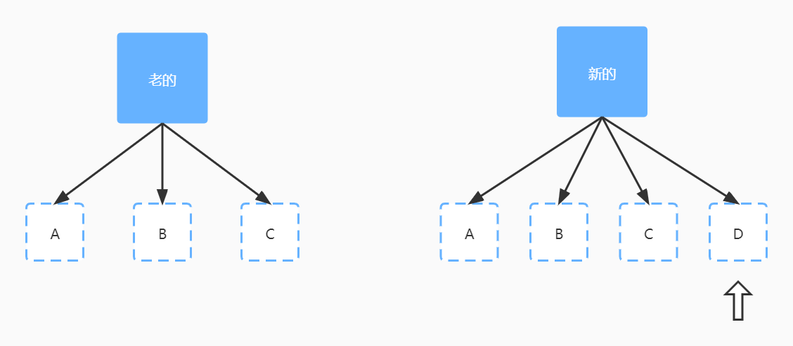
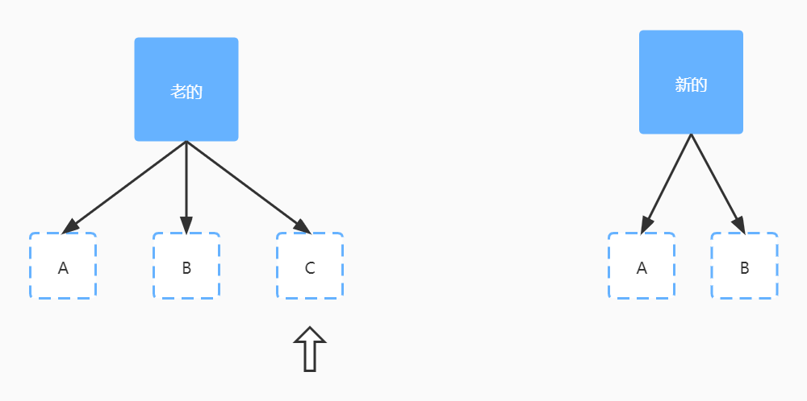
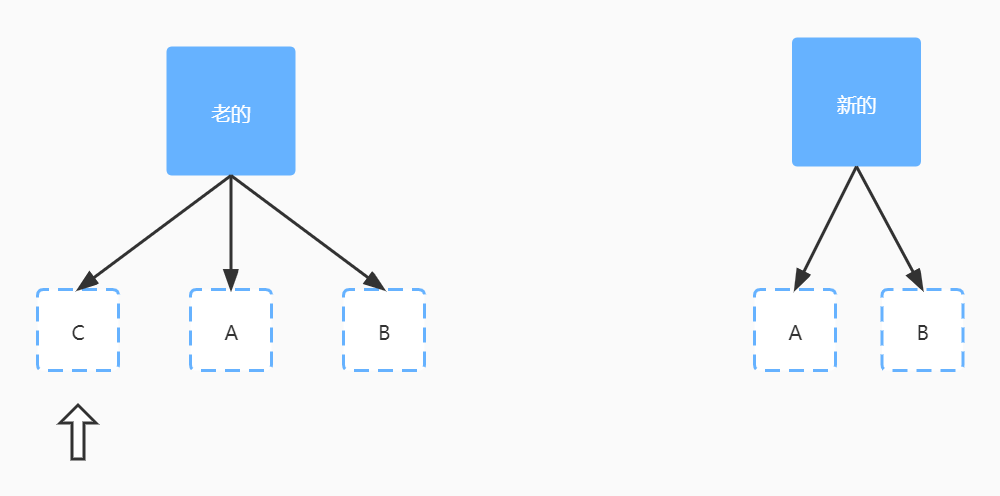
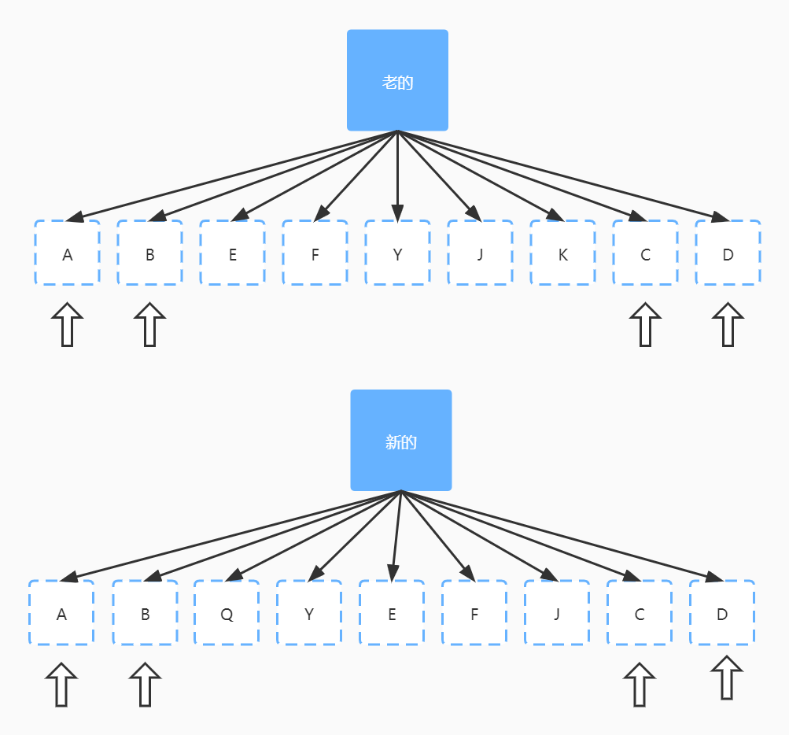
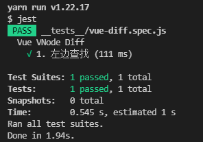

# 根据大崔哥的mini-vue来理解vue中的diff算法

数组类型之间的对比采用的叫双端对比算法，所谓双端对比算法就是先看左侧，看完左侧看右侧，然后锁定中间乱序的部分。目的就是为了锁定中间乱序的部分，为什么要采用这种算法呢？因为在我们前端这个应用来说，很多时候我们去操作DOM的时候，很有可能只是改变其中某一个元素，有可能是删除它，有可能是添加它，有可能是移动一下位置，而两边的元素根本没有发生变化，如果我们去遍历所有的节点的话，这个操作是一个O(n)的时间复杂度。而通过双端对比去缩小范围，这样n就会变小，很明显就会提高我们的性能。所以这种双端对比算法只是针对前端这种特定的场景来实现的一种算法。

双端对比算法的核心就是筛选出中间乱序的部分。

先处理左侧

 

先从左侧开始进行对比，很明显左侧的A、B都是相同的，然后锁定左侧相同的部分，处理右侧乱序部分。

再处理右侧

 

从右侧开始对比，很明显右侧的B、C都是相同的，然后锁定右侧相同部分，处理左侧乱序部分。

新的比老的长，创建

左侧一样，把新创建的添加到尾部

 

可以看到新的比老的多，新的多了一个D，多出来的这个节点就需要创建并添加到尾部

从右侧进行对比

  

可以看到新的左侧多了一个E，这里和左侧对比不同之处是这里需要把新元素添加到头部

老的比新的长，删除

 

从右侧开始对比

 


除了上面这几种比较简单的场景意外，最复杂的就是中间对比了。

 

- 创建新的（Q）：在老的里面不存在，新的里面存在
- 删掉老的（K）：在老的里面存在，新的里面不存在
- 移动（Y、J）：节点存在新的和老的里面，但是位置变了

以上就是双端对比算法需要处理的所有场景了。

用代码模拟实现

```javascript
const prevVNode = [{ key: "a" }, { key: "b" }, { key: "c" }]
const nextVNode = [{ key: "a" }, { key: "b" }, { key: "d" }, { key: "e" }]
```

假如我们有上面两组新老虚拟DOM数据，那么怎么实现对比呢？通过上面的了解我们知道双端对比算法的核心是找出乱序的部分。我们可以通过三个指针来实现：

- 指针`e1`为 `prevVNode`的最后一位元素的索引值
- 指针`e2`为 `nextVNode`的最后一位元素的索引值
- 指针`i`为从左侧开始新老`VNode`元素不相等时的索引值，一开始`i`为0，只要新老元素相等i就往后移，也就是`i++`，然后再去匹配下一对新老元素是否相等，一样的话继续往后走，即继续`i++`，直到新老元素不一样的时候`i`就固定下来了。比如上面的`prevVNode`和`nextVNode`不相等的元素是从`c、d`开始，`c、d`的索引值都是2
- 循环条件是`i`不能大于`e1`并且也不能大于`e2`，很明显大于的话就超出索引了，获取不到元素了

代码模拟

从左边往右查找，如果节点可以复用，则继续往右，不能就停止循环

```javascript
exports.vueDiff = (c1, c2, { mountElement, patch, unmount, move }) => {
    function isSameVnodeType(n1, n2) {
        return n1.key === n2.key; //&& n1.type === n2.type;
    }
    let i = 0
    let e1 = c1.length - 1
    let e2 = c2.length - 1
    // *1. 从左边往右查找，如果节点可以复用，则继续往右，不能就停止循环
    while(i <= e1 && i <= e2) { // 通过上面分析我们可以知道循环条件
        // 取出新老元素
        const n1 = c1[i]
        const n2 = c2[i]
        // 对比是否一样
        if(isSameVnodeType(n1, n2)) {
            // 一样就递归调用
            patch(n1.key)
        } else {
            // 如果不一样就退出循环
            break
        }
        i ++ // 指针往后移动
    }
}
```

左边查找的测试用例

```javascript
  it('1. 左边查找', () => {
    const mountElement = jest.fn()
    const patch = jest.fn()
    const unmount = jest.fn()
    const move = jest.fn()
    const { vueDiff } = require('../vue-diff')
    vueDiff(
      [{ key: 'a' }, { key: 'b' }, { key: 'c' }],
      [{ key: 'a' }, { key: 'b' }, { key: 'd' }, { key: 'e' }],
      {
        mountElement,
        patch,
        unmount,
        move
      }
    )
    // 第一次调用次数
    expect(patch.mock.calls.length).toBe(2)
    // 第一次调用的第一个参数
    expect(patch.mock.calls[0][0]).toBe('a')
    expect(patch.mock.calls[1][0]).toBe('b')
  })
```

执行测试

 

